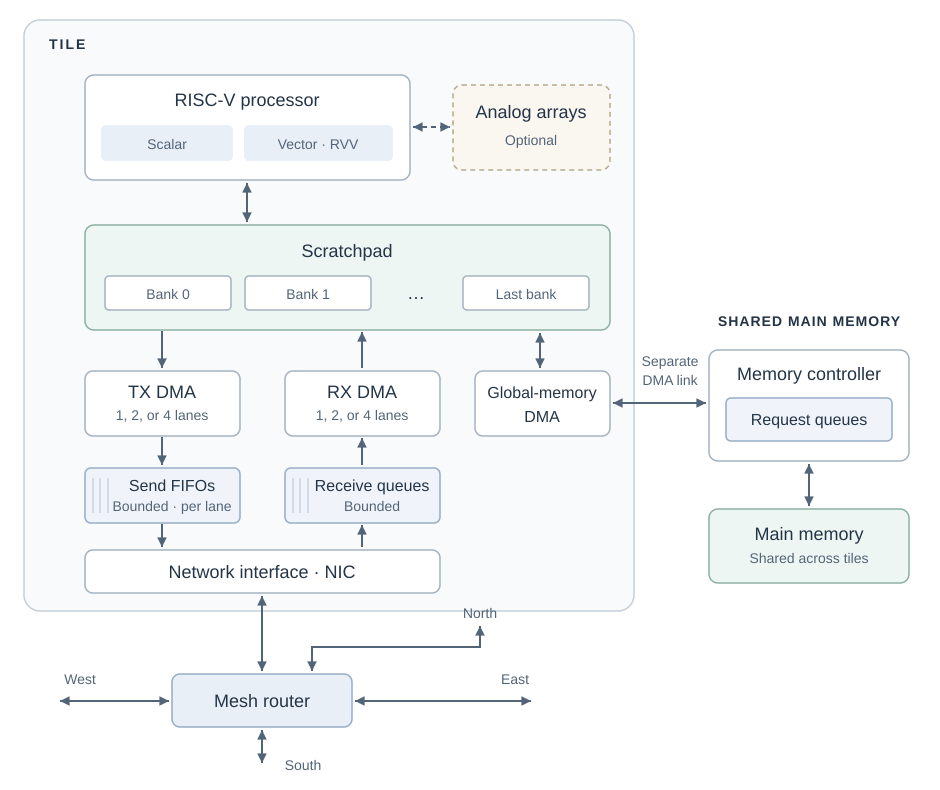
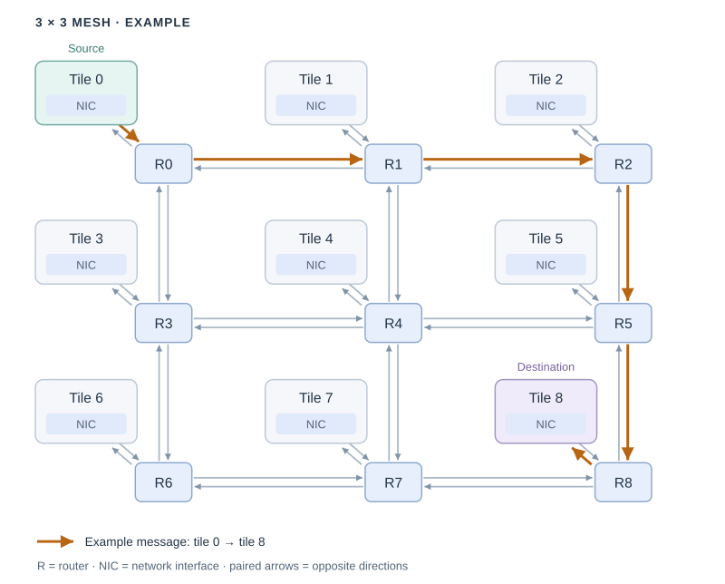

# RISC-V Tile Simulator

This project simulates a grid of RISC-V tiles. Each tile runs a program,
performs scalar and vector computation, and keeps its code and data in a scratchpad.
Tiles exchange data through a mesh network. Optional analog arrays provide
matrix computation.

## Architecture

### Inside one tile



A tile is one compute unit with its own processor and local memory. It contains:

- **A RISC-V processor** that runs the tile's program. Scalar instructions work
  on individual values; vector instructions work on several values at once.
- **A scratchpad** that holds the tile's program, constants, working data and
  stack. The memory is divided into banks, allowing independent accesses
  when their read and write ports are available.
- **An 8 KiB instruction cache** that fetches instructions from the scratchpad.
  Code is loaded into the scratchpad before execution; larger datasets move
  through explicit DMA transfers. There is no data cache or automatic paging.
- **TX and RX DMA engines** that send and receive scratchpad data while the
  processor can continue computing. Each TX lane has its own send queue; RX takes
  arriving data from receive queues. These queues have limited space: when full,
  they make incoming data wait. Both engines share the scratchpad with the processor.
- **A network interface** that connects those engines to the tile's mesh router,
  shown outside the tile boundary.
- **Global-memory DMA** that transfers data between the scratchpad and shared
  main memory through a separate memory controller, not through the mesh.
- **Optional analog arrays** for matrix computation.

You can vary vector width, instruction-cache size, scratchpad capacity and
banking, memory access timing, simultaneous sends and receives, and analog
array dimensions and timing. The executable-SPM path currently uses single-issue
CPU timing.

### Connecting tiles



**Connections.** Each tile connects through its network interface to one router.
Routers connect to their immediate north, south, east, and west neighbors, with
traffic supported in both directions. Edge and corner routers have fewer neighbors.

**Moving a message.** The highlighted route travels horizontally first, then
vertically to its destination. Intermediate routers forward the data without
involving their tiles' processors. Messages move in small pieces, so one transfer
can span several links at once.

**Sharing the network.** Different links can carry traffic simultaneously.
Messages needing the same outgoing link take turns; input queues hold waiting
data. When a queue fills, the router feeding it must wait too.

The 3×3 grid is an example, not a fixed size. You can vary grid dimensions,
link width and clock rate, router delay, and queue capacity. Shared main memory
uses the separate DMA path shown above, not these mesh links.

### Running the simulation

QEMU runs each tile's program; SST calculates simulated execution and transfer
time. Processor timing is based on instruction accounting, not a detailed
processor pipeline.

## Build and run

This project has only been tested on ARM processors so far.
The first command checks the required build tools:

```bash
bash bootstrap.sh check
JOBS=8 bash bootstrap.sh build
bash tests/run-all.sh --case network/mesh-3x3
```

Run these from the repository root. The build prepares the dependencies and
simulator. The test boots two SPM-backed tiles at opposite corners of a 3×3
mesh and checks their messages and routes. The other routers forward traffic
without running tile programs.

## Learn more

- [Understand the machine](docs/architecture.md): components and how data moves between them.
- [Configure the machine](docs/parameters.md): parameter names, units, and defaults.
- [Run the tests](tests/README.md): what is checked and how to run it.
- [Find the implementation](src/README.md): source files for each part of the machine.
