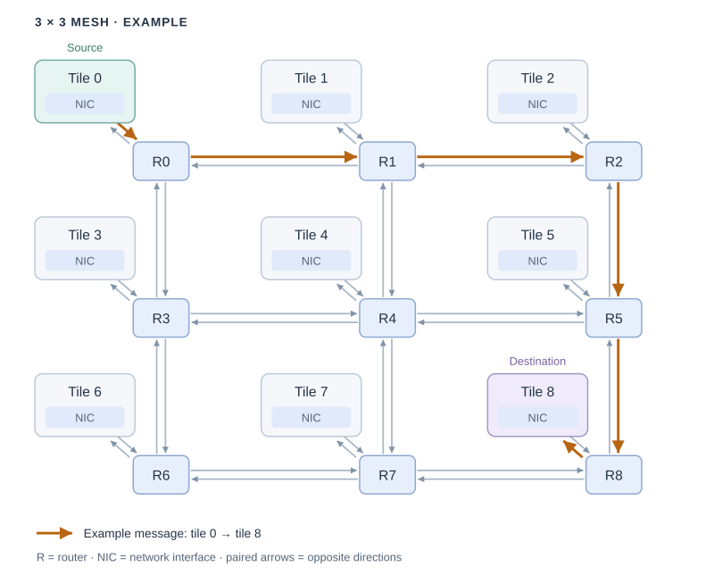

# RISC-V Tile Simulator

This project simulates a grid of RISC-V tiles. Each tile runs a program,
performs scalar and vector computation, and keeps its code and data in a scratchpad.
Tiles exchange data through a mesh network. Optional analog arrays provide
matrix computation.

## Architecture

### Inside one tile


A tile in [`src`](src/README.md) has its own processor, local
scratchpad, analog arrays and network interface. The drawing shows module
relationships: solid arrows carry data, requests and responses; dashed arrows
show control. Repeated bank and array outlines represent replication.

- **RISC-V CPU:** instruction execution and control, scalar and vector registers,
  an instruction cache, a vector load/store queue, and an analog command queue.
  Eligible vector memory operations use the vector load/store queue. Blocking
  scalar loads/stores and instruction-cache fills join queued vector accesses
  at one CPU memory port connected to the SPM bus.
- **Shared banked SPM:** one bus connects clients to the controller, whose
  bank/channel scheduling serves the physical banks and their read/write ports.
  CPU and network access can select overlapping sets of banks; shared banks contend for the same
  ports and channels. Code, constants, working data and stack live here.
- **Analog accelerator:** each replicated unit has a command queue,
  register-transfer engine, input buffer, analog array and output buffers.
  The array retains its programmed weights. Array payloads pass through CPU
  vector registers. The compute pipeline can overlap
  input preparation, computation and output handling. Arrays have no direct
  SPM or network connection.
- **Network interface:** the NIU queues transfer requests and local SPM accesses.
  It manages receive storage, ordering and storage credits. The Mordred NIC
  provides network buffering and packet/flit transport. Network payload travels
  between SPM and NIU without passing through CPU registers.
- **Mordred mesh router:** input buffers and virtual channels feed the
  router switch and output buffers. Routing, arbitration and link credits
  control progress. Each tile attaches to a router through its NIC.

The diagram groups functional modules; it is not a detailed physical CPU
pipeline. Queue depths, widths, capacities and array counts are configured
separately. Scalar compute launch and queued vector-array transfers use the
array command interface, with register dependencies preserved.

Current multi-tile tests use an external test controller to launch network
requests and consume local arrival notifications. That test infrastructure is
outside the hardware drawing. Guest CPUs access local SPM; a guest network-send
instruction is not implemented. Posted sends reserve receiver storage and
return storage credits internally after destination SPM service.

### Connecting tiles



**Connections.** Each tile connects through its network interface to one router.
Routers connect to their immediate north, south, east, and west neighbors, with
traffic supported in both directions. Edge and corner routers have fewer neighbors.

**Moving a message.** The highlighted route travels horizontally first, then
vertically to its destination. Intermediate routers forward the data without
involving their tiles' processors. Messages move in small pieces, so one transfer
can span several links at once.

**Sharing the network.** Different links can carry traffic simultaneously.
Messages needing the same outgoing link take turns; input queues hold waiting
data. When a queue fills, the router feeding it must wait too.

The 3×3 grid is an example, not a fixed size. Mesh dimensions, link width and
buffering are configurable. The complete-tile helper composes a CPU, SPM,
arrays and network interface for each router.

### Running the simulation

QEMU runs each tile's program; SST calculates simulated execution and transfer
time. Processor timing is based on instruction accounting, not a detailed
processor pipeline.

## Build and run

This project has only been tested on ARM processors so far.
The first command checks the required build tools:

```bash
bash bootstrap.sh check
JOBS=8 bash bootstrap.sh build
bash tests/run-all.sh --case network/mordred-spm
```

Run these from the repository root. The build prepares the dependencies and
simulator. The test boots four complete tiles in a 2×2 Mordred mesh and checks timed
network/SPM transfers and CPU-visible data. The standard correctness suite is
`bash tests/run-all.sh --suite hardware`; `--list` shows individual suites.

The former simulator has been retired. `source_new` remains a compatibility
link to `src` for existing study scripts. See the [migration record](docs/migration.md)
for recovery, build ownership and remaining guest networking work.

## Learn more

- [Understand the current machine](src/README.md): components, composition and architecture parameters.
- [Configure CPU and router bank connections](src/components/mordred/spm-interface.md): NIU queues, credits and shared SPM service.
- [Run the tests](tests/README.md): what is checked and how to run it.
- [Enable cycle profiling](docs/profiling.md): default-off recording for CPU, SPM, accelerator and network components.
- [Find the current implementation](src/README.md#composition): source files and composition helpers.
