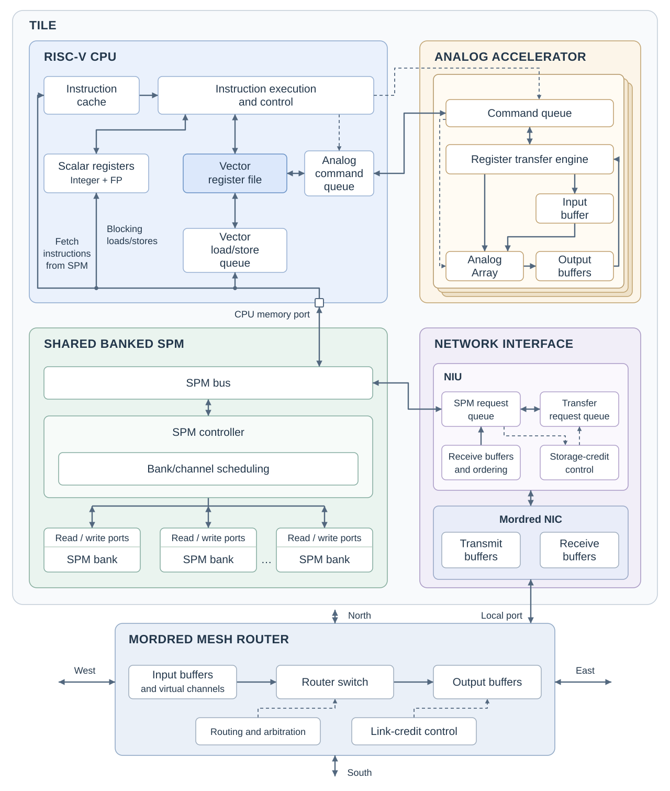

# RISC-V Tile Simulator

An SST/QEMU simulator for RISC-V tiles with RVV, shared banked scratchpad memory,
analog accelerators, and a Mordred mesh network.



QEMU executes guest programs; SST models timing. The CPU and network interface
share SPM banks. Analog arrays exchange weights, inputs, and outputs through CPU
vector registers.

## Build and test

```bash
bash bootstrap.sh check
JOBS=8 bash bootstrap.sh build
bash tests/run-all.sh --suite hardware
```

Run from the repository root. Tested on ARM hosts. Use `--list` to see individual
test suites. Cycle profiling is optional and off by default.

The implementation lives in [`src/`](src/README.md). Current network tests launch
transfers through a test controller; guest-initiated sends remain pending.

[Parameters](docs/parameters.md) · [Tests](tests/README.md) ·
[Profiling](docs/profiling.md) · [Mesh diagram](docs/diagrams/mesh-connections.svg)
