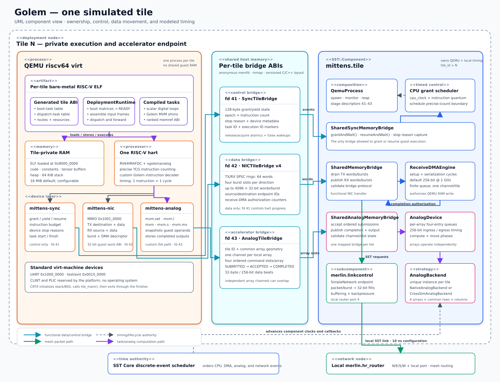
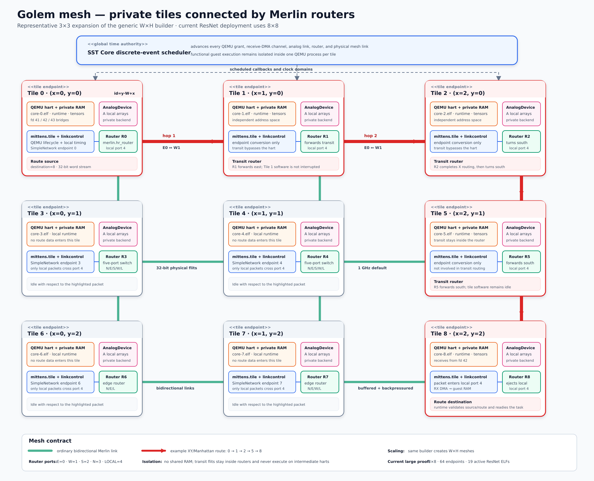

# Architecture diagrams

These diagrams are editable SVG source files. They describe the implemented
Platform v0.1 boundaries rather than a proposed architecture.

## One tile

[Open the full-size single-tile UML diagram](single-tile-uml.svg).

The tile diagram separates guest-visible structures from host integration:

- the generated per-tile ELF and runtime;
- private QEMU RAM and the RISC-V hart;
- the fd 41 synchronization, fd 42 NIC, and fd 43 analog bridges;
- the owning SST `mittens.tile` component;
- receive-DMA, analog-device, and numerical-backend timing; and
- the local Merlin endpoint.

## Mesh

[Open the full-size mesh topology diagram](mesh-topology.svg).

The mesh diagram expands a readable 3x3 instance of the generic `W x H`
builder. The same construction creates the current 8x8 ResNet-18 deployment.
The highlighted packet uses a four-hop Manhattan route from tile 0 to tile 8.
Only routers forward transit traffic; intermediate tile harts and their private
RAM are not involved.
