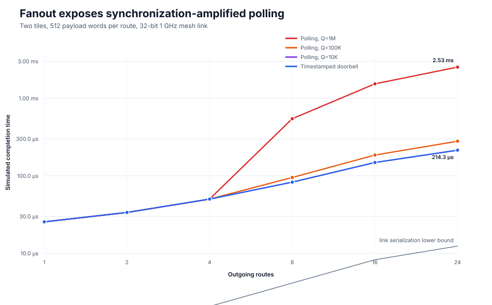
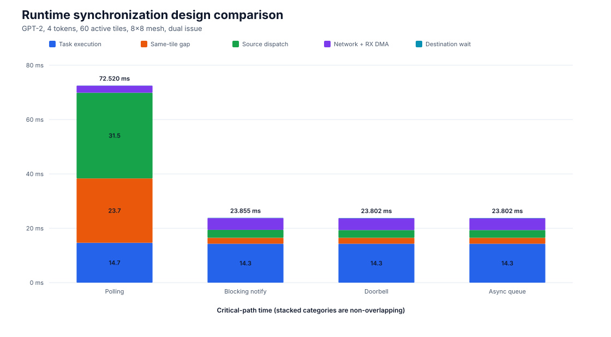
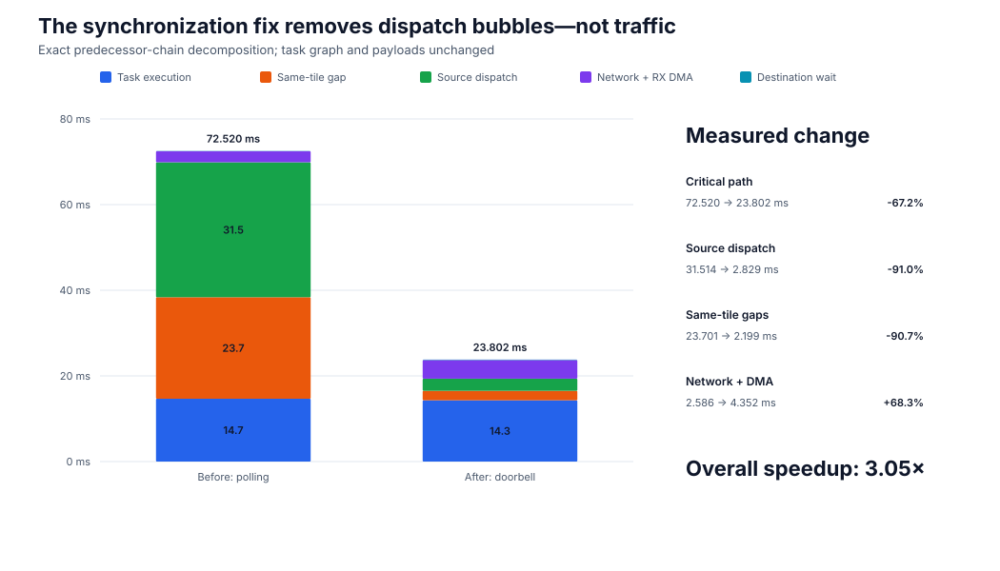
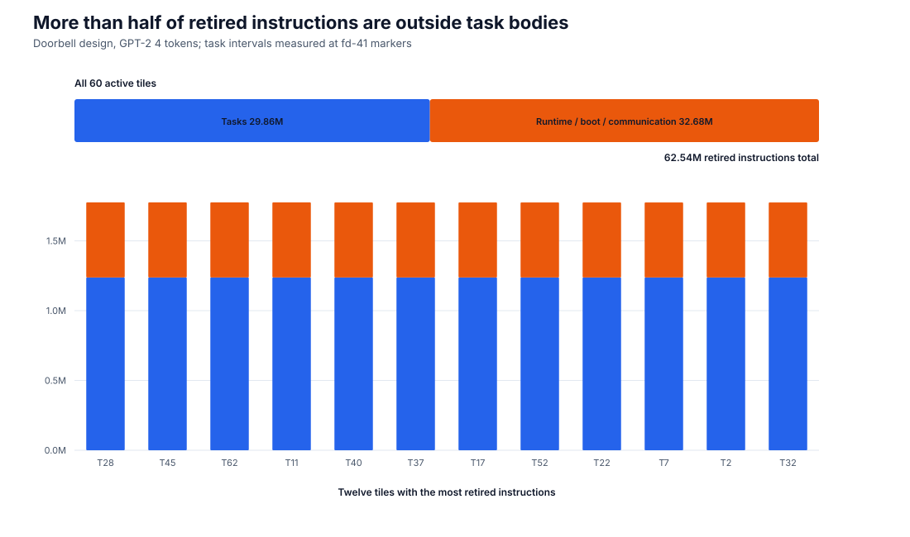
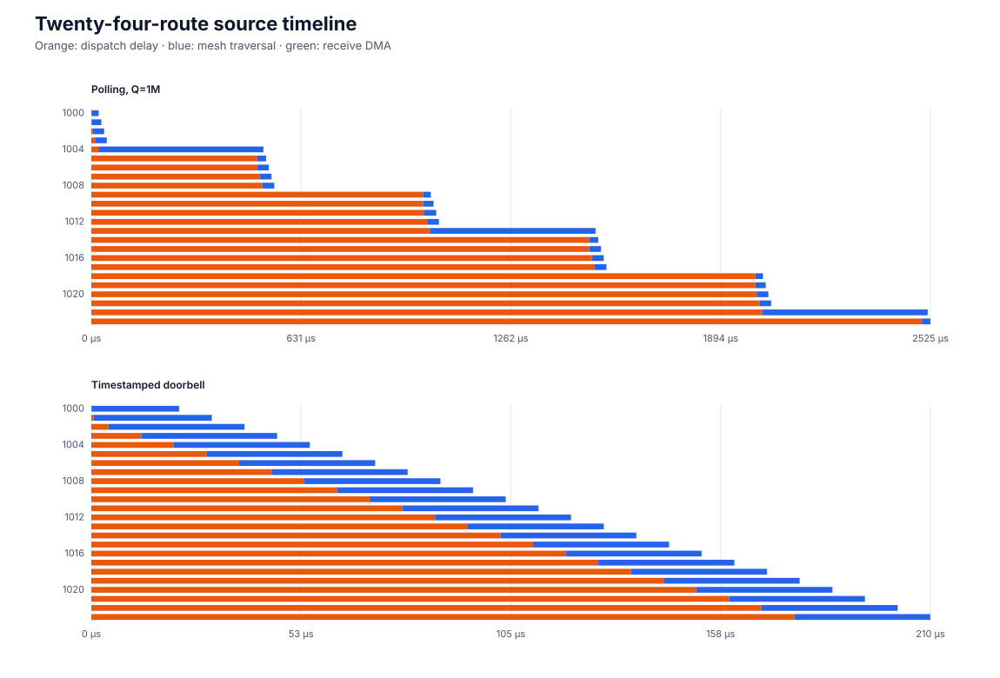
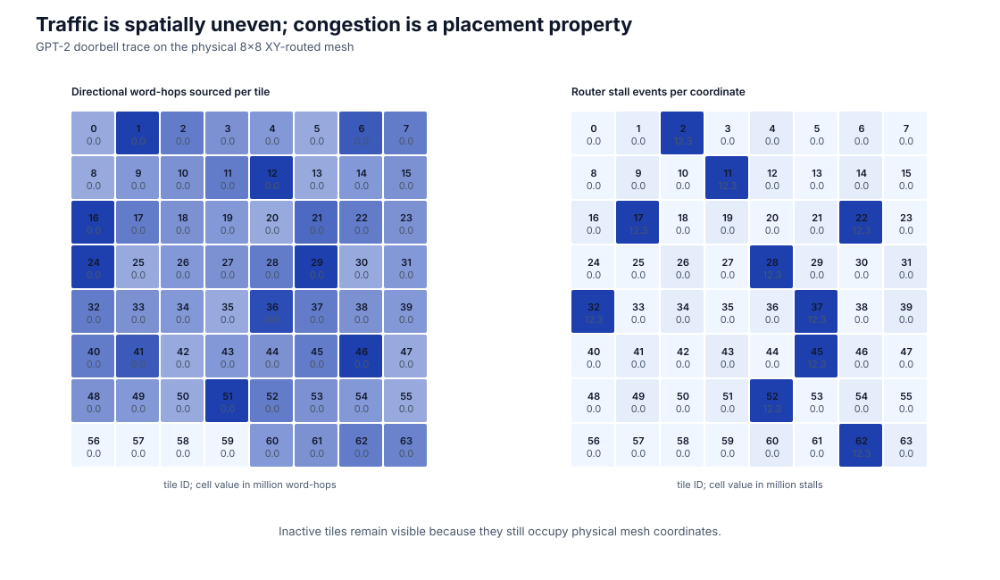

# Transmit synchronization study

This study validates and repairs the QEMU/SST transmit synchronization path.
It separates physical 32-bit link service from guest-side polling caused by a
full four-entry shared-memory transmit ring.

## Result

The original runtime resumed QEMU even when SST had not freed a transmit-ring
entry. A sender could therefore retry until the end of a large instruction
quantum. The corrected design has two parts:

1. `TX_WAIT` blocks a guest that has no safe work while its transmit ring is
   full.
2. Every accepted burst raises a zero-wait fd-41 descriptor doorbell, giving
   SST the exact simulated CPU timestamp at which the burst became visible.

The 24-route microbenchmark demonstrates the failure directly:

| Design | QEMU quantum | Simulated time | Retired instructions |
|---|---:|---:|---:|
| Polling | 1,000,000 | 2.528505 ms | 5,121,535 |
| Polling | 100,000 | 279.801 us | — |
| Polling | 10,000 | 214.265 us | — |
| Timestamped doorbell | 1,000,000 | 214.252 us | quantum-invariant |
| Timestamped doorbell | 100,000 | 214.252 us | quantum-invariant |
| Timestamped doorbell | 10,000 | 214.252 us | quantum-invariant |

The full GPT-2 result uses four tokens, 60 active tiles, an 8×8 mesh, dual
issue, 1 GHz CPU and mesh clocks, 32-bit links, and the native analog backend.
The task graph is unchanged across the comparison:

| Metric | Polling | Timestamped doorbell |
|---|---:|---:|
| Simulated completion | 72.744181 ms | 24.026442 ms |
| Tasks | 1,597 | 1,597 |
| Routes | 1,186 | 1,186 |
| Injected words | 773,930 | 773,930 |
| Directional word-hops | 1,147,447 | 1,147,447 |
| Output signature | finite | `3218958869 / 1008262912` |

This is a 3.028× reduction without changing workload, placement, payload
volume, topology, or link width. Critical-path source-dispatch time falls from
31.514 ms to 2.829 ms, and same-tile gaps fall from 23.701 ms to 2.199 ms.
Network plus receive-DMA time rises from 2.586 ms to 4.352 ms because the
repaired model now exposes real overlapping traffic and contention instead of
serializing it behind QEMU polling.

The conservative asynchronous runtime policy completes in 24.026443 ms—one
picosecond after the blocking policy. That is a useful negative result:
the four-entry descriptor path does not constrain this GPT-2 mapping after
descriptor timestamps are modeled correctly. Increasing runtime queueing
alone cannot improve this workload.

Trace and summary builds now produce the exact same output signature. The
doorbell trace retires 62,536,306 instructions: 29,857,225 inside compiled
task bodies and 32,679,081 in boot, runtime, communication, and other
out-of-task execution.

## Figures













## Reproduce

Run the four fanout matrices:

```bash
MITTENS_FANOUT_MODE=polling ./tests/transmit-fanout/run-test.sh
MITTENS_FANOUT_MODE=blocking ./tests/transmit-fanout/run-test.sh
MITTENS_FANOUT_MODE=overlap-blocking ./tests/transmit-fanout/run-test.sh
MITTENS_FANOUT_MODE=async ./tests/transmit-fanout/run-test.sh
```

Run the final GPT-2 trace:

```bash
MITTENS_GPT2_CPU_ISSUE_WIDTH=2 \
MITTENS_GPT2_PROFILE_MODE=trace \
MITTENS_GPT2_TRANSMIT_POLICY=blocking \
MITTENS_GPT2_DEPLOYMENT_DIR="$PWD/build/tests/sculptor-gpt2-8x8/deployment-doorbell-blocking-trace" \
./tests/sculptor-gpt2-8x8/run-deployment.sh
```

Regenerate the SVGs and create a self-contained results archive:

```bash
./scripts/plot-transmit-synchronization-study.py
./scripts/package-transmit-synchronization-study.sh
```

All plotted time is SST simulated time, not simulator wall-clock time.
